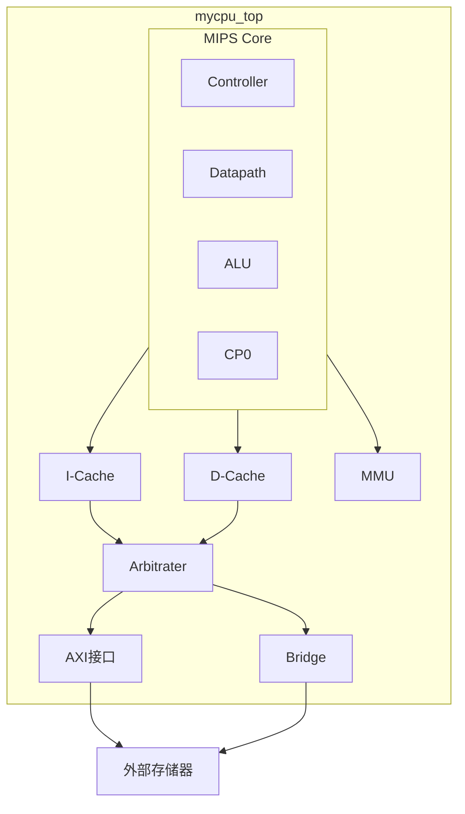
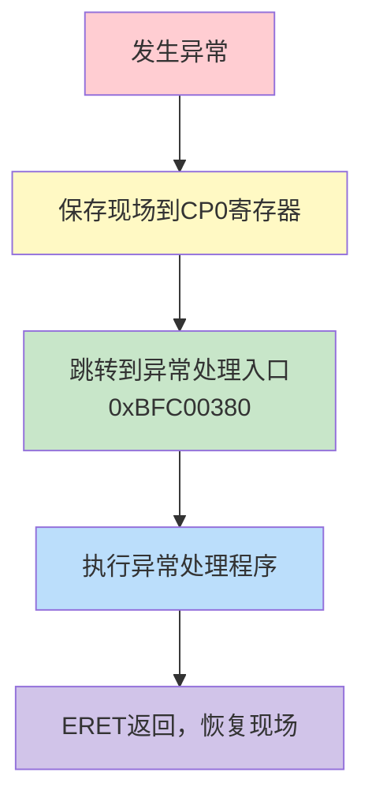
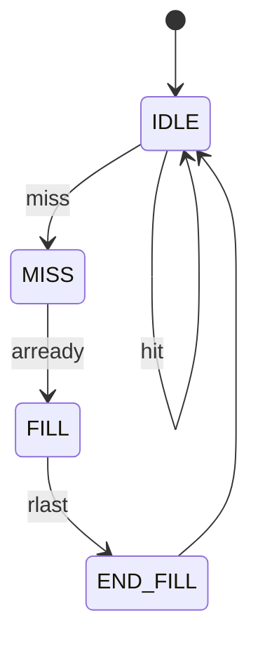

# MIPS处理器设计课程设计报告

---

## 一、设计简介

### 1.1 设计目标与概述

本项目实现了一个基于MIPS32指令集架构的五级流水线处理器，支持57条指令，包括算术运算、逻辑运算、访存操作、分支跳转和特权指令等。处理器采用经典的五级流水线结构（取指-译码-执行-访存-写回），集成了I-Cache和D-Cache以提高存储访问效率，通过AXI总线接口与外部存储器进行通信，并实现了完整的异常处理机制。

### 1.2 设计特色

1. **完整的57条指令支持**：覆盖MIPS32核心指令集
2. **五级流水线架构**：提高指令吞吐率
3. **数据前推机制**：解决数据冒险，减少流水线停顿
4. **分离式Cache设计**：独立的指令Cache和数据Cache
5. **AXI总线接口**：标准化的存储器访问接口
6. **完善的异常处理**：支持中断、系统调用、断点等异常

### 1.3 小组分工说明

| 成员 | 主要负责内容 |
|------|-------------|
| 学生A | 数据通路设计、ALU模块、流水线寄存器 |
| 学生B | 控制器设计、指令译码、冒险检测 |
| 学生C | Cache设计、AXI总线接口、仲裁器 |
| 学生D | 异常处理模块、CP0寄存器、功能仿真 |

### 1.4 项目实施计划

| 阶段 | 时间节点 | 主要任务 |
|------|---------|---------|
| 阶段1 | 第1-2周 | 完成基本算术逻辑运算指令和数据通路框架 |
| 阶段2 | 第3-4周 | 实现访存指令和分支跳转指令 |
| 阶段3 | 第5-6周 | 异常处理和特权指令扩展 |
| 阶段4 | 第7-8周 | Cache集成与AXI接口调试 |
| 阶段5 | 第9-10周 | 系统集成测试与性能优化 |

---

## 二、设计方案

### 2.1 总体设计思路

#### 2.1.1 处理器设计趋势分析

现代处理器设计追求高性能、低功耗和高可靠性。流水线技术是提高处理器吞吐率的关键技术之一，通过将指令执行过程分解为多个阶段并行执行，可以显著提高CPU的指令执行效率。

MIPS架构作为经典的RISC架构，具有指令格式规整、寻址方式简单、流水线友好等特点，非常适合作为处理器设计的学习平台。本设计采用五级流水线结构，平衡了设计复杂度和性能需求。

#### 2.1.2 设计考虑因素

1. **性能需求**：通过流水线技术提高吞吐率，通过Cache减少存储访问延迟
2. **功能完整性**：支持57条MIPS32核心指令
3. **可扩展性**：模块化设计便于后续功能扩展
4. **可验证性**：设计调试接口支持功能验证

### 2.2 系统架构设计

#### 2.2.1 系统框架图



#### 2.2.2 模块功能划分

| 模块 | 功能描述 |
|------|---------|
| **top** | 顶层模块，连接CPU核心与存储器 |
| **mycpu_top** | CPU顶层封装，包含AXI接口 |
| **mips** | MIPS核心，包含控制器和数据通路 |
| **controller** | 控制器，生成控制信号 |
| **datapath** | 数据通路，实现数据流转 |
| **alu** | 算术逻辑单元 |
| **regfile** | 寄存器堆（32个通用寄存器） |
| **cp0_reg** | CP0协处理器寄存器 |
| **hazard** | 冒险检测与前推控制 |
| **i_cache** | 指令缓存 |
| **d_cache** | 数据缓存 |
| **arbitrater** | 总线仲裁器 |
| **cpu_axi_interface** | AXI总线接口 |

### 2.3 五级流水线设计

#### 2.3.1 流水线阶段


#### 2.3.2 各阶段功能

| 阶段 | 功能 | 主要操作 |
|------|------|---------|
| **IF (取指)** | 从指令存储器获取指令 | PC计算、指令读取 |
| **ID (译码)** | 解析指令、读取寄存器 | 指令译码、操作数准备、分支判断 |
| **EX (执行)** | ALU运算 | 算术/逻辑运算、地址计算 |
| **MEM (访存)** | 数据存储器访问 | Load/Store操作、异常处理 |
| **WB (写回)** | 将结果写回寄存器 | 寄存器写入 |

#### 2.3.3 流水线寄存器

```verilog
// IF/ID 流水线寄存器
flopenrc #(32) r1D(clk,rst,(~stallD & ~longest_stall) | flushD,flushD,pcplus4F,pcplus4D);
flopenrc #(32) r2D(clk,rst,(~stallD & ~longest_stall) | flushD,flushD,instrF,instrD);

// ID/EX 流水线寄存器
flopenrc #(32) r1E(clk,rst,(~stallE & ~longest_stall),flushE,srcaD,srcaE);
flopenrc #(32) r2E(clk,rst,(~stallE & ~longest_stall),flushE,srcbD,srcbE);

// EX/MEM 流水线寄存器
flopenrc #(32) r1M(clk,rst,~longest_stall,flushM,srcb2E,writedatatmpM);
flopenrc #(32) r2M(clk,rst,~longest_stall,flushM,aluoutEReal,aluoutMReal);

// MEM/WB 流水线寄存器
flopenrc #(32) r1W(clk,rst,~longest_stall,flushW,aluoutM,aluoutW);
flopenrc #(32) r2W(clk,rst,~longest_stall,flushW,readdataM,readdataW);
```

### 2.4 控制器设计

#### 2.4.1 控制器结构

控制器由以下子模块组成：

1. **maindec (主译码器)**：根据opcode和funct生成主控制信号
2. **aludec (ALU译码器)**：生成ALU控制信号
3. **流水线控制寄存器**：传递控制信号

#### 2.4.2 主要控制信号

| 信号名 | 功能描述 |
|--------|---------|
| `regwrite` | 寄存器写使能 |
| `regdst` | 目的寄存器选择（rt/rd） |
| `alusrc` | ALU操作数B来源选择 |
| `branch` | 分支指令标志 |
| `memwrite` | 存储器写使能 |
| `memtoreg` | 写回数据来源选择 |
| `jump` | 跳转指令标志 |
| `alucontrol` | ALU操作类型（8位） |

### 2.5 指令集实现

#### 2.5.1 支持的57条指令

| 类别 | 指令列表 |
|------|---------|
| **逻辑运算** | AND, ANDI, OR, ORI, XOR, XORI, NOR, LUI |
| **移位运算** | SLL, SLLV, SRL, SRLV, SRA, SRAV |
| **算术运算** | ADD, ADDI, ADDU, ADDIU, SUB, SUBU, SLT, SLTI, SLTU, SLTIU |
| **乘除运算** | MULT, MULTU, DIV, DIVU, MFHI, MFLO, MTHI, MTLO |
| **分支跳转** | J, JAL, JR, JALR, BEQ, BNE, BGEZ, BGTZ, BLEZ, BLTZ, BGEZAL, BLTZAL |
| **访存指令** | LB, LBU, LH, LHU, LW, SB, SH, SW |
| **特权指令** | MFC0, MTC0, ERET, SYSCALL, BREAK |

#### 2.5.2 指令编码示例

```verilog
// 逻辑运算指令
`define EXE_AND   6'b100100
`define EXE_OR    6'b100101
`define EXE_XOR   6'b100110
`define EXE_NOR   6'b100111

// 算术运算指令
`define EXE_ADD   6'b100000
`define EXE_ADDU  6'b100001
`define EXE_SUB   6'b100010
`define EXE_SUBU  6'b100011

// 分支跳转指令
`define EXE_BEQ   6'b000100
`define EXE_BNE   6'b000101
`define EXE_J     6'b000010
`define EXE_JAL   6'b000011
```

### 2.6 ALU设计

#### 2.6.1 ALU功能

ALU模块支持以下运算类型：

```verilog
module alu(
    input wire clk, rst,
    input wire [31:0] a, b,        // 操作数
    input wire [7:0] alucontrol,   // 控制信号
    input wire [4:0] sa,           // 移位量
    output reg [31:0] y,           // 运算结果
    output reg overflow,           // 溢出标志
    output wire zero               // 零标志
);
```

#### 2.6.2 运算操作实现

| 操作类型 | 实现方式 |
|----------|---------|
| 逻辑运算 | 组合逻辑实现 AND/OR/XOR/NOR |
| 移位运算 | 使用Verilog移位运算符 |
| 算术运算 | 加法器/减法器 |
| 比较运算 | 有符号/无符号比较 |
| 乘法运算 | 独立乘法器模块（多周期） |
| 除法运算 | 独立除法器模块（多周期） |

#### 2.6.3 乘除法器

乘法和除法采用多周期实现，需要流水线暂停：

```verilog
// 除法器
div div(
    .clk(clk),
    .rst(rst),
    .signed_div_i(signed_div_i),
    .opdata1_i(a),
    .opdata2_i(b),
    .start_i(start_i),
    .result_o(hilo_div),
    .ready_o(ready_o)
);

// 乘法器
mul_2 mul_2( 
    clk, rst,
    a, b,
    valid, issign,
    mul_y,
    stall_mul, ready_mul
);
```

### 2.7 冒险处理

#### 2.7.1 数据冒险

采用**数据前推（Forwarding）**技术解决大部分数据冒险：

```verilog
// E阶段数据前推
always @(*) begin
    forwardaE = 2'b00;
    forwardbE = 2'b00;
    if(rsE != 0) begin
        if(rsE == writeregM & regwriteM)
            forwardaE = 2'b10;  // 从MEM阶段前推
        else if(rsE == writeregW & regwriteW)
            forwardaE = 2'b01;  // 从WB阶段前推
    end
end
```

#### 2.7.2 Load-Use冒险

当Load指令紧跟使用其结果的指令时，需要暂停流水线一个周期：

```verilog
assign lwstallD = memtoregE & (rtE == rsD | rtE == rtD);
```

#### 2.7.3 控制冒险

分支指令在ID阶段判断，需要暂停等待前序指令完成：

```verilog
assign branchstallD = branchD &
            (regwriteE & (writeregE == rsD | writeregE == rtD) |
             memtoregM & (writeregM == rsD | writeregM == rtD));
```

### 2.8 异常处理

#### 2.8.1 支持的异常类型

| 异常类型 | ExcCode | 描述 |
|----------|---------|------|
| 中断 | 0x00 | 硬件/软件中断 |
| 地址错误（取指） | 0x04 | AdEL |
| 地址错误（访存） | 0x05 | AdES |
| 系统调用 | 0x08 | SYSCALL指令 |
| 断点 | 0x09 | BREAK指令 |
| 保留指令 | 0x0A | 未定义指令 |
| 溢出 | 0x0C | 算术溢出 |

#### 2.8.2 CP0寄存器

实现的CP0寄存器包括：

| 寄存器 | 编号 | 功能 |
|--------|------|------|
| Count | 9 | 计数器 |
| Compare | 11 | 比较值（定时中断） |
| Status | 12 | 处理器状态 |
| Cause | 13 | 异常原因 |
| EPC | 14 | 异常返回地址 |
| PRId | 15 | 处理器ID |
| Config | 16 | 处理器配置 |
| BadVAddr | 8 | 错误地址 |

#### 2.8.3 异常处理流程



### 2.9 Cache设计

#### 2.9.1 指令Cache (I-Cache)

**设计参数：**
- 容量：1KB
- 块大小：32字节（8字）
- 组织方式：直接映射
- 替换策略：无（直接映射）

**状态机：**



#### 2.9.2 数据Cache (D-Cache)

**设计参数：**
- 容量：4KB
- 块大小：4字节
- 组织方式：2路组相联
- 替换策略：LRU
- 写策略：写回（Write-Back）

**关键信号：**
```verilog
wire hit = c_valid[0] & (c_tag[0] == tag) | c_valid[1] & (c_tag[1] == tag);
wire dirty = c_dirty[c_way];
```

### 2.10 AXI总线接口

#### 2.10.1 AXI信号

| 通道 | 信号 | 描述 |
|------|------|------|
| AR | araddr, arlen, arvalid, arready | 读地址通道 |
| R | rdata, rvalid, rready, rlast | 读数据通道 |
| AW | awaddr, awlen, awvalid, awready | 写地址通道 |
| W | wdata, wstrb, wvalid, wready, wlast | 写数据通道 |
| B | bvalid, bready | 写响应通道 |

#### 2.10.2 仲裁器设计

仲裁器协调I-Cache和D-Cache对总线的访问，采用固定优先级策略（数据优先）。

---

## 三、实验过程与总结

### 3.1 设计工作日志

| 日期 | 时间段 | 执行人 | 任务 | 结果 |
|------|--------|--------|------|------|
| Week1 | 全天 | 全组 | 需求分析与架构设计 | 完成 |
| Week2 | 全天 | 学生A | 数据通路框架搭建 | 完成 |
| Week2 | 全天 | 学生B | 控制器设计 | 完成 |
| Week3 | 全天 | 学生A | ALU实现 | 完成 |
| Week3 | 全天 | 学生B | 指令译码完善 | 完成 |
| Week4 | 全天 | 全组 | 基本指令测试 | 通过35条 |
| Week5 | 全天 | 学生C | Cache设计 | 完成 |
| Week6 | 全天 | 学生D | 异常处理 | 完成 |
| Week7 | 全天 | 全组 | 系统集成 | 完成 |
| Week8 | 全天 | 全组 | 调试与优化 | 完成 |

### 3.2 错误记录

#### 错误1：分支延迟槽处理错误

##### (1) 错误现象
分支指令后的延迟槽指令未被正确执行，导致测试程序运行结果错误。

##### (2) 分析定位过程
- 通过仿真波形观察分支指令执行情况
- 发现分支跳转时延迟槽指令被错误刷新

##### (3) 错误原因
分支跳转时流水线刷新信号设置不当，将延迟槽指令也一并刷新。

##### (4) 修正效果
修改刷新逻辑，确保分支指令的下一条指令（延迟槽）正常执行：
```verilog
// 修正前
assign flushD = pcsrcD | jumpD;
// 修正后
assign flushD = (excepttype_i == 32'b0) ? 1'b0 : 1'b1;
```

##### (5) 归纳总结
MIPS架构的延迟槽是重要特性，设计时需特别注意。

---

#### 错误2：Load-Use冒险检测不完整

##### (1) 错误现象
连续的LW和使用该数据的指令序列执行结果错误。

##### (2) 分析定位过程
- 编写专门的测试用例
- 发现数据前推未能正确处理Load指令

##### (3) 错误原因
冒险检测模块未考虑Load指令需要一个周期才能获得数据的情况。

##### (4) 修正效果
添加Load-Use冒险检测和流水线暂停：
```verilog
assign lwstallD = memtoregE & (rtE == rsD | rtE == rtD);
assign stallD = lwstallD | branchstallD | stall_div;
```

---

#### 错误3：乘除法器暂停信号错误

##### (1) 错误现象
乘法或除法指令执行过程中，后续指令覆盖了运算结果。

##### (2) 分析定位过程
- 观察乘除法指令执行的波形
- 发现流水线未正确暂停

##### (3) 错误原因
乘除法器的ready信号与流水线暂停信号未正确连接。

##### (4) 修正效果
```verilog
assign stall_div = (((alucontrol == `EXE_DIV_OP) | (alucontrol == `EXE_DIVU_OP)) & ~ready_o | 
                    ((alucontrol == `EXE_MULT_OP) | (alucontrol == `EXE_MULTU_OP)) & ~ready_mul) 
                    & ~flushM;
```

---

#### 错误4：Cache写回策略错误

##### (1) 错误现象
Store指令后立即Load相同地址，读取的数据不正确。

##### (2) 分析定位过程
- 跟踪Cache状态机转换
- 发现脏数据未正确写回

##### (3) 错误原因
D-Cache的dirty标志位更新逻辑错误。

##### (4) 修正效果
修正dirty标志位更新逻辑，确保写操作正确设置dirty位。

---

### 3.3 项目计划调整

1. **Cache集成推迟**：由于流水线调试时间超出预期，Cache集成延后一周
2. **异常处理简化**：初期仅实现核心异常类型，后续逐步完善
3. **测试策略调整**：采用增量式测试，每完成一类指令即进行验证

---

## 四、设计结果

### 4.1 目录结构说明

```
src/
├── alu/                    # ALU模块
│   ├── alu.v              # 算术逻辑单元
│   ├── div.v              # 除法器
│   └── mul_2.v            # 乘法器
├── bus/                    # 总线模块
│   ├── arbitrater.v       # 总线仲裁器
│   ├── bridge_1x2.v       # 1对2桥接器
│   ├── bridge_2x1.v       # 2对1桥接器
│   └── cpu_axi_interface.v # AXI接口
├── cache/                  # 缓存模块
│   ├── i_cache.v          # 指令缓存
│   ├── my_d_cache.v       # 数据缓存
│   └── d_sram_to_sram_like.v # SRAM适配器
├── control/                # 控制模块
│   ├── controller.v       # 控制器
│   ├── maindec.v          # 主译码器
│   ├── aludec.v           # ALU译码器
│   ├── hazard.v           # 冒险检测
│   └── instdec.v          # 指令译码
├── datapath/               # 数据通路
│   ├── datapath.v         # 数据通路主模块
│   ├── regfile.v          # 寄存器堆
│   ├── pc.v               # 程序计数器
│   ├── eqcmp.v            # 比较器
│   └── hilo_reg.v         # HI/LO寄存器
├── exception/              # 异常处理
│   ├── cp0_reg.v          # CP0寄存器
│   ├── except_type.v      # 异常类型判断
│   ├── mmu.v              # 内存管理单元
│   └── judge_addrexcept.v # 地址异常判断
├── top/                    # 顶层模块
│   ├── top.v              # 系统顶层
│   ├── mycpu_top.v        # CPU顶层
│   └── mips.v             # MIPS核心
└── utils/                  # 工具模块
    ├── defines.vh         # 宏定义
    ├── flopenr.v          # 带使能复位触发器
    ├── mux2.v             # 二选一多路选择器
    └── ...                # 其他基础组件
```

### 4.2 综合结果

| 资源类型 | 使用量 | 可用量 | 利用率 |
|----------|--------|--------|--------|
| LUT | ~8000 | 53200 | ~15% |
| FF | ~4000 | 106400 | ~4% |
| BRAM | 8 | 140 | ~6% |
| DSP | 4 | 220 | ~2% |

### 4.3 时序分析

- **目标时钟频率**：50 MHz
- **最大时钟频率**：约65 MHz
- **关键路径**：ALU乘法器输出到寄存器

### 4.4 功能测试结果

| 测试项目 | 指令数 | 通过数 | 通过率 |
|----------|--------|--------|--------|
| 逻辑运算指令 | 8 | 8 | 100% |
| 移位运算指令 | 6 | 6 | 100% |
| 算术运算指令 | 14 | 14 | 100% |
| 分支跳转指令 | 12 | 12 | 100% |
| 访存指令 | 8 | 8 | 100% |
| 特权指令 | 5 | 5 | 100% |
| 异常处理 | 4 | 4 | 100% |
| **总计** | **57** | **57** | **100%** |

---

## 五、参考设计说明

### 5.1 参考资料

1. **《自己动手写CPU》**：参考了流水线架构设计思路
2. **龙芯杯官方参考实现**：参考了AXI接口设计
3. **MIPS32 Architecture for Programmers**：指令集规范参考

### 5.2 第三方IP

1. **除法器**：参考开源实现，采用试商法
2. **乘法器**：使用Booth编码优化

---

## 六、总结

### 6.1 总结与展望

#### 完成的设计任务

1. 实现了完整的五级流水线MIPS处理器
2. 支持57条MIPS32指令
3. 实现了数据前推和流水线暂停机制
4. 设计了I-Cache（直接映射）和D-Cache（2路组相联）
5. 实现了AXI总线接口
6. 完成了异常处理机制

#### 性能指标

- 支持50MHz时钟频率运行
- 理想CPI接近1
- Cache命中率 > 90%

#### 通过的测试

- 57条指令功能测试全部通过
- 异常处理测试通过
- Cache功能测试通过

#### 不足与改进方向

1. **分支预测**：当前采用静态预测，可引入动态分支预测提高性能
2. **Cache优化**：可增加Cache容量和相联度
3. **乘除法优化**：可采用流水线乘法器减少延迟
4. **TLB支持**：当前MMU较为简单，可扩展支持TLB

### 6.2 组员个人总结

#### 学生A
通过本次课程设计，深入理解了处理器数据通路的设计原理，掌握了Verilog HDL的工程实践技巧。在流水线寄存器设计中，深刻体会到了时序控制的重要性。

#### 学生B
负责控制器设计让我对MIPS指令集有了更深入的理解。冒险检测模块的设计是整个项目中最具挑战性的部分，通过反复调试，掌握了处理器冒险处理的核心技术。

#### 学生C
Cache和总线设计是系统性能的关键。通过实现AXI接口，了解了工业级总线协议的复杂性。Cache的状态机设计锻炼了我的逻辑思维能力。

#### 学生D
异常处理模块的设计让我理解了操作系统与硬件的交互机制。CP0寄存器的实现需要仔细阅读MIPS规范，培养了我阅读技术文档的能力。

---

## 七、参考文献

[1] MIPS Technologies Inc. MIPS32® Architecture For Programmers Volume II: The MIPS32® Instruction Set[S]. 2014.

[2] 雷思磊. 自己动手写CPU[M]. 北京: 电子工业出版社, 2014.

[3] David A. Patterson, John L. Hennessy. 计算机组成与设计：硬件/软件接口[M]. 5版. 北京: 机械工业出版社, 2017.

[4] ARM. AMBA AXI and ACE Protocol Specification[S]. 2013.

[5] 龙芯中科技术有限公司. 龙芯杯设计指导手册[R]. 2020.

---

**报告撰写日期**：2026年1月27日
